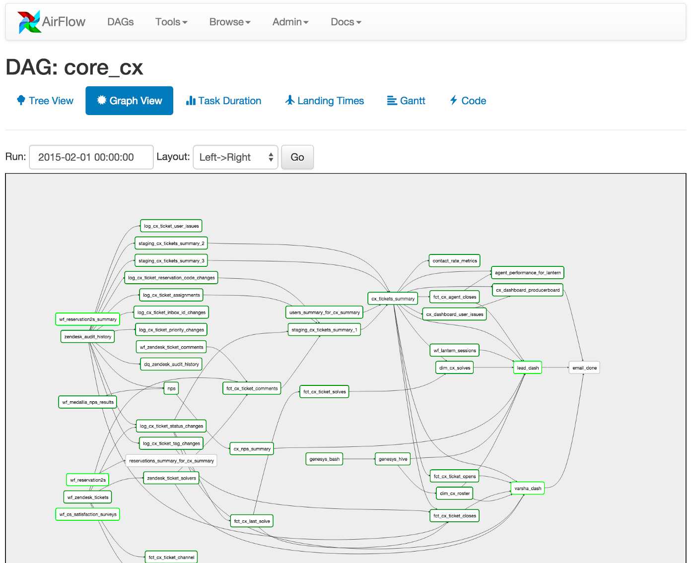
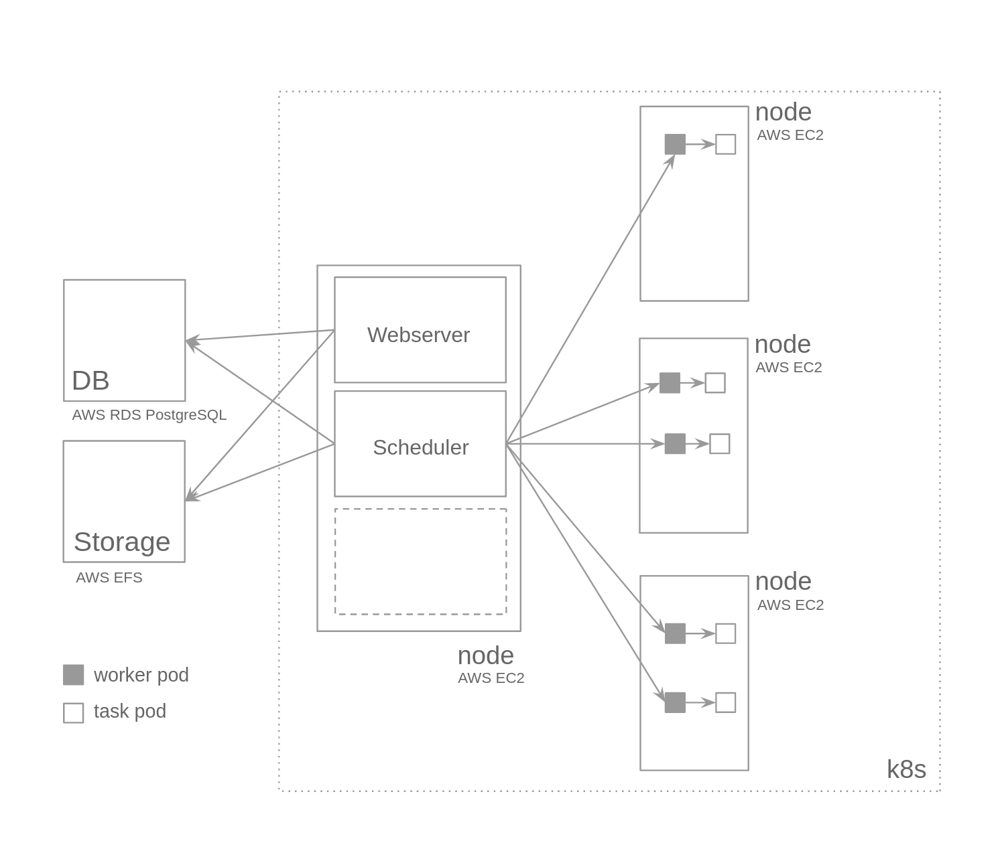

# Apache - Airflow
Repo to demonstrate Apache Airflow in local cluster.

### What is Airflow
In simpler terms, Airflow is a platform to programmatically author, schedule and monitor workflows.
It can be used to schedule a sequence of tasks in a workflows as a directed acyclic graphs (DAG).
In depth, can read from [airflow.apache.org](https://airflow.apache.org/)

In Airflow all workflows are DAGs. A Dag consists of operators. An operator defines an individual task that needs to be performed. 

Per Airflow, Different types of operators available are as follows:
- **BashOperator** - executes a bash command
- **PythonOperator** - calls an arbitrary Python function
- **EmailOperator** - sends an email
- **SimpleHttpOperator** - sends an HTTP request
- **MySqlOperator** - executes a SQL command in MySQL. Specific operators are available for each database.
- **Sensor** - waits for a certain time, file, database row, S3 key, etc…

### Architecture

### Steps to Install
  - Specify the repo alongwith version to be used in [Charts.yaml](.helm/apache-airflow/Chart.yaml)
  - Install the dependency mentioned in charts by executing the command:
    `helm dependency update .helm/apache-airflow`
  - Helm install using `helm install rl-apache-airflow .helm/apache-airflow`
  - Check the status of installation using `helm list`
  - Export the name of web-server pod using `export POD_NAME=$(kubectl get pods --namespace default -l "component=web,app=airflow" -o jsonpath="{.items[0].metadata.name}")`
  - Echo local url to check the status `echo http://127.0.0.1:8080`
  - Port forward the port 8080 to access the cluster locally `kubectl port-forward --namespace default $POD_NAME 8080:8080`
  - Login into browser credentials `admin/admin`

### Add DAG to Airflow
  - dfdfd
  - dfdf
  - dfdf

### References
  - [towardsdatascience.com: a-journey-to-airflow-on-kubernetes](https://towardsdatascience.com/a-journey-to-airflow-on-kubernetes-472df467f556)
  - [github: apache/airflow](https://github.com/apache/airflow)
  - [medium.com: Setting up airflow on a local kubernetes cluster](https://medium.com/uncanny-recursions/setting-up-airflow-on-a-local-kubernetes-cluster-using-helm-57eb0b73dc02)
  - [github.com: airflow-helm/charts](https://github.com/airflow-helm/charts/tree/main/charts/airflow)