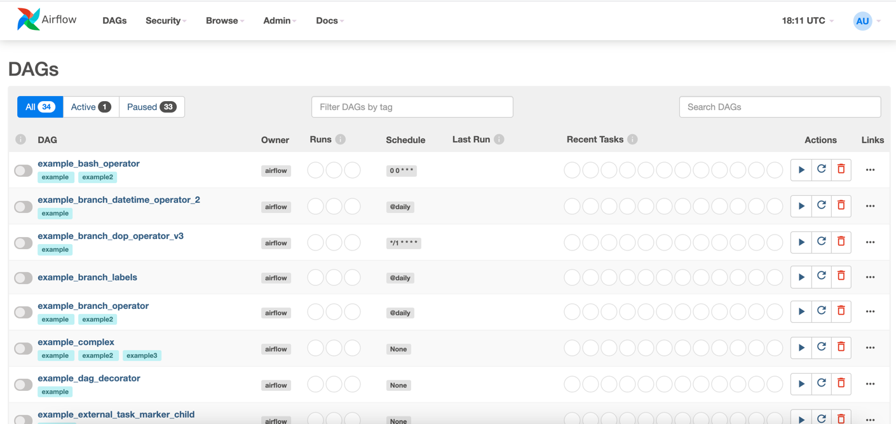
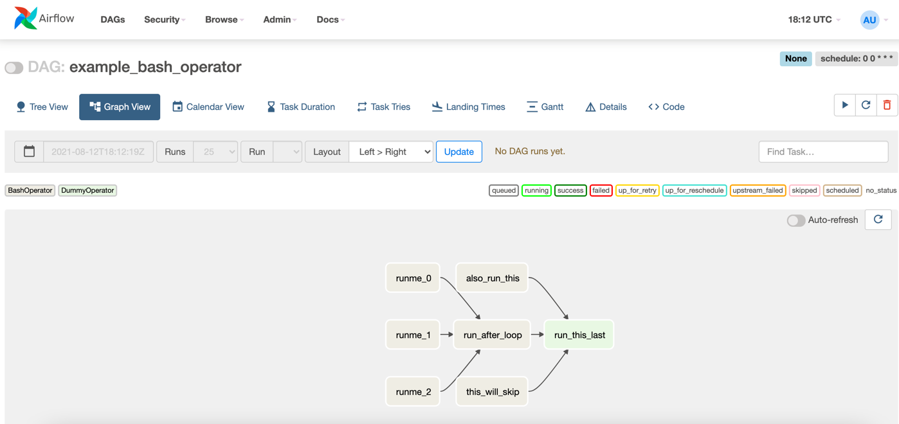
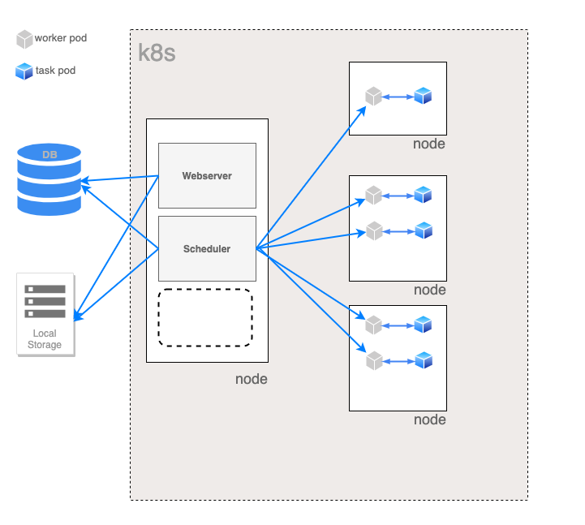
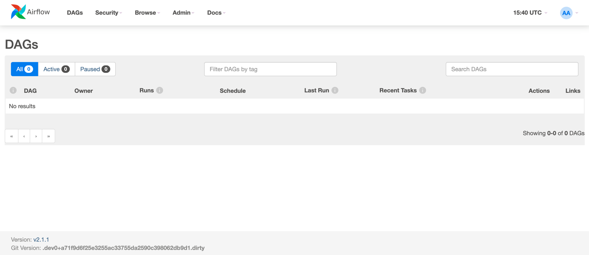

# Apache - Airflow
Repo to demonstrate Apache Airflow in local cluster.


### What is Airflow
In simpler terms, Airflow is a platform to programmatically author, schedule and monitor workflows.
It can be used to schedule a sequence of tasks in a workflows as a directed acyclic graphs (DAG).
In depth, can read from [airflow.apache.org](https://airflow.apache.org/)




In Airflow all workflows are DAGs. A Dag consists of operators. An operator defines an individual task that needs to be performed. 

Per Airflow, Different types of operators available are as follows:
- **BashOperator** - executes a bash command
- **PythonOperator** - calls an arbitrary Python function
- **EmailOperator** - sends an email
- **SimpleHttpOperator** - sends an HTTP request
- **MySqlOperator** - executes a SQL command in MySQL. Specific operators are available for each database.
- **Sensor** - waits for a certain time, file, database row, S3 key, etc…

### Architecture



### Steps to Install
  - Specify the repo alongwith version to be used in [Charts.yaml](.helm/backup/Chart.yaml)
  - Install the dependency mentioned in charts by executing the command:
    `helm dependency update .helm/apache-airflow`
  - Helm install using `helm install rl-apache-airflow .helm/apache-airflow`
  - Check the status of installation using `helm list`
  - Export the name of web-server pod using `export POD_NAME=$(kubectl get pods --namespace default -l "component=web,app=airflow" -o jsonpath="{.items[0].metadata.name}")`
  - Echo local url to check the status `echo http://127.0.0.1:8080`
  - Port forward the port 8080 to access the cluster locally `kubectl port-forward --namespace default $POD_NAME 8080:8080`
  - Login into browser using credentials `admin/admin`



### Add DAG to Airflow
  - In order to override default generate a values.yaml file using command:
    - `helm show values apache-airflow/airflow > .helm/apache-airflow/values.yaml`
  - Edit the file with below config:
```python  
  # Mount additional volumes into scheduler.
  extraVolumeMounts: # this will get the volume and mount it to that path in the container
    - name: dags
      mountPath: /opt/airflow/dags  # location in the container it will put the directory mentioned below.

  extraVolumes: # this will create the volume from the directory
    - name: dags
      hostPath:
        path: "<path-to-repo>/apache-airflow/dags"  # Location of Physical Dags
```

### Usage
  - To prepare and set up pre-requisite, execute the makefile  command: `make prep`
  - Post prep, In order to deploy the setup, execute the makefile command:  `make deploy`

### Extend Base Image
  - Create a [Dockerfile](Dockerfile) and add required steps i.e. pip install etc
  - Build and push the extended image into docker registry: ```make extend-image```
  - Edit the [values.yaml](.helm/apache-airflow/values.yaml) at below steps:
```buildoutcfg
# Default airflow repository -- overrides all the specific images below
defaultAirflowRepository: <repo-user-name>/airflow

# Default airflow tag to deploy
defaultAirflowTag: "0.0.1"

# Airflow version (Used to make some decisions based on Airflow Version being deployed)
airflowVersion: "2.1.2"

# Images
images:
  airflow:
    repository: <repo-user-name>/airflow
    tag: 0.0.1
    pullPolicy: Always    
```
   - Also create secret in required namespace (apache-airflow in this case) and add its name in values.yaml file:
```buildoutcfg
# Auth secret for a private registry
# This is used if pulling airflow images from a private registry
registry:
  secretName: regdockhub
```

### Note:
    Local path reference has to be set in order to use this repo

### References
  - [github: airflow-helm/charts](https://github.com/airflow-helm/charts/tree/main/charts/airflow)
  - [github: apache/airflow](https://github.com/apache/airflow)
  - [marclamberti.com: airflow-on-kubernetes-get-started-in-10-mins](https://marclamberti.com/blog/airflow-on-kubernetes-get-started-in-10-mins/)  
  - [towardsdatascience.com: a-journey-to-airflow-on-kubernetes](https://towardsdatascience.com/a-journey-to-airflow-on-kubernetes-472df467f556)
  - [medium.com: Setting up airflow on a local kubernetes cluster](https://medium.com/uncanny-recursions/setting-up-airflow-on-a-local-kubernetes-cluster-using-helm-57eb0b73dc02)
