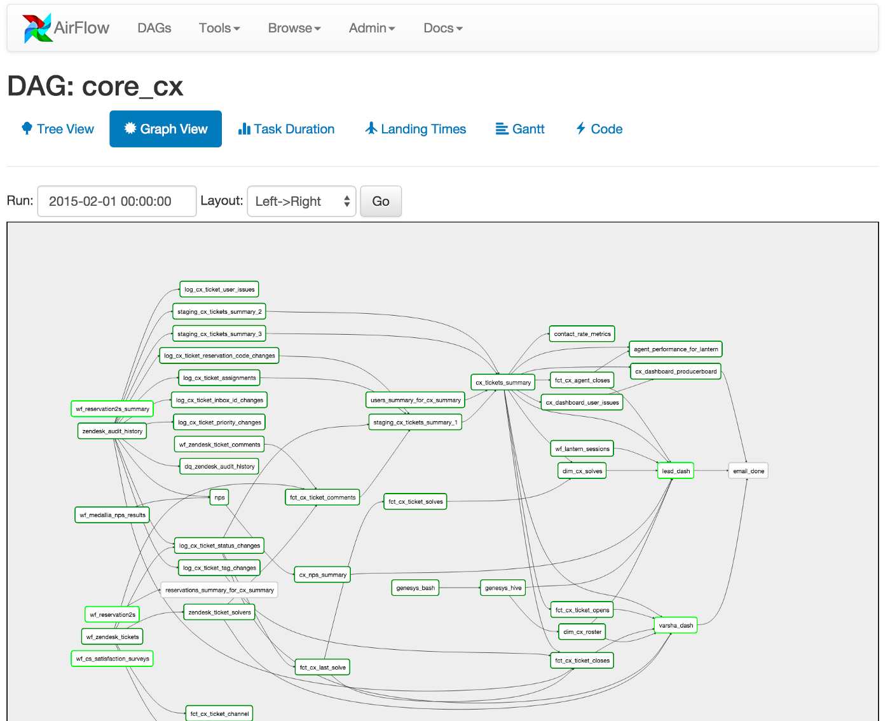

# Apache - Airflow
Repo to demonstrate Apache Airflow in local cluster.

### What is Airflow
In simpler terms, Airflow is a platform to programmatically author, schedule and monitor workflows.
It can be used to schedule a sequence of tasks in a workflows as a directed acyclic graphs (DAG).
In depth, can read from [airflow.apache.org](https://airflow.apache.org/)

In Airflow all workflows are DAGs. A Dag consists of operators. An operator defines an individual task that needs to be performed. 

Per Airflow, Different types of operators available are as follows:
- **BashOperator** - executes a bash command
- **PythonOperator** - calls an arbitrary Python function
- **EmailOperator** - sends an email
- **SimpleHttpOperator** - sends an HTTP request
- **MySqlOperator** - executes a SQL command in MySQL. Specific operators are available for each database.
- **Sensor** - waits for a certain time, file, database row, S3 key, etc…

### Architecture

### References
- [towardsdatascience.com: a-journey-to-airflow-on-kubernetes](https://towardsdatascience.com/a-journey-to-airflow-on-kubernetes-472df467f556)
- [github:apache/airflow](https://github.com/apache/airflow)
- [Youtube: Running Apache Airflow with the KubernetesExecutor on a multi-node Kubernetes cluster locally](https://youtu.be/AjBADrVQJv0)
- [Youtube: Airflow on Kubernetes - Containerizing your workflows](https://youtu.be/3VDeKmxHWYA)